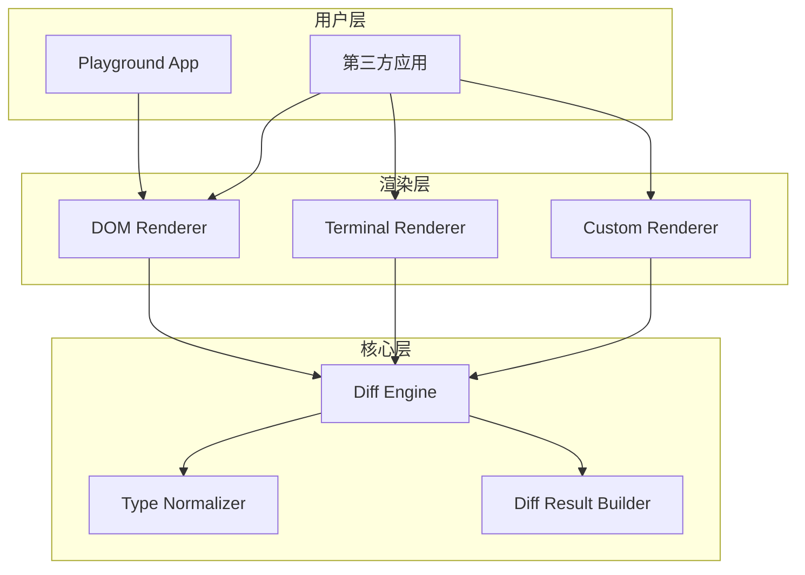

# Design Document: JSON Visual Diff SDK

## Overview

本设计文档描述了一个通用的 JSON 可视化 diff SDK 的架构和实现细节。该 SDK 采用分层架构，将核心 diff 算法、标准化的差异表示、以及可插拔的渲染系统分离，实现了高度的模块化和可扩展性。

### 核心设计理念

1. **关注点分离**：核心算法与渲染逻辑完全解耦
2. **可扩展性**：通过 Adapter 模式支持任意渲染目标
3. **类型安全**：使用 TypeScript 提供完整的类型定义
4. **性能优先**：采用高效的 diff 算法处理大型数据结构
5. **开发者友好**：提供清晰的 API 和完善的文档

### 技术栈（统一用最新版本）

- **语言**：TypeScript 
- **包管理**：pnpm workspace
- **构建工具**：Vite
- **测试框架**：Vitest + fast-check
- **代码规范**：Oxlint + Oxfmt

## Architecture

### 整体架构图



### 分层说明


**核心层（Core Layer）**
- 负责计算两个值之间的差异
- 处理类型规范化（函数、Date、RegExp 等）
- 生成标准化的 Diff Result
- 不依赖任何平台特定的 API

**渲染层（Renderer Layer）**
- 实现 Renderer 接口
- 将 Diff Result 转换为特定平台的输出
- 可以是 DOM、终端、Canvas、React 组件等
- 每个渲染器都是独立的 npm 包

**用户层（Application Layer）**
- 使用核心库和渲染器
- Playground 是官方提供的演示应用
- 第三方应用可以自由组合使用

### Monorepo 结构

```
json-visual-diff/
├── packages/
│   ├── core/                 # 核心 diff 算法库
│   │   ├── src/
│   │   │   ├── diff.ts       # 主 diff 引擎
│   │   │   ├── types.ts      # 类型定义
│   │   │   ├── normalizer.ts # 类型规范化
│   │   │   ├── result.ts     # Diff Result 构建器
│   │   │   └── index.ts      # 导出接口
│   │   ├── tests/
│   │   └── package.json
│   │
│   ├── dom-renderer/         # DOM 渲染器
│   │   ├── src/
│   │   │   ├── renderer.ts   # DOM 渲染实现
│   │   │   ├── styles.ts     # 样式定义
│   │   │   └── index.ts
│   │   ├── tests/
│   │   └── package.json
│   │
│   └── playground/           # 演示应用 代码编辑器基于 Monaco Editor
│       ├── src/
│       │   ├── App.tsx
│       │   └── main.tsx
│       └── package.json
│
├── pnpm-workspace.yaml
├── package.json
├── tsconfig.json
└── README.md
```

## Components and Interfaces

### 1. 核心类型定义


```typescript
/**
 * 差异类型枚举
 */
enum DiffType {
  ADDED = 'added',       // 新增
  DELETED = 'deleted',   // 删除
  MODIFIED = 'modified', // 修改
  UNCHANGED = 'unchanged' // 未改变
}

/**
 * 值类型枚举
 */
enum ValueType {
  PRIMITIVE = 'primitive', // 原始类型
  OBJECT = 'object',       // 对象
  ARRAY = 'array',         // 数组
  FUNCTION = 'function',   // 函数
  DATE = 'date',           // 日期
  REGEXP = 'regexp',       // 正则
  UNDEFINED = 'undefined', // undefined
  NULL = 'null',           // null
  SYMBOL = 'symbol'        // Symbol
}

/**
 * 差异节点接口
 */
interface DiffNode {
  type: DiffType;           // 差异类型
  path: string[];           // JSON Path
  valueType: ValueType;     // 值类型
  oldValue?: any;           // 旧值（删除或修改时）
  newValue?: any;           // 新值（添加或修改时）
  children?: DiffNode[];    // 子节点（对象或数组）
}

/**
 * Diff 结果接口
 */
interface DiffResult {
  root: DiffNode;           // 根节点
  stats: {                  // 统计信息
    added: number;
    deleted: number;
    modified: number;
    unchanged: number;
  };
}

/**
 * Diff 配置选项
 */
interface DiffOptions {
  maxDepth?: number;        // 最大比较深度
  ignoreKeys?: string[];    // 忽略的键
  arrayDiffMode?: 'lcs' | 'position'; // 数组比较模式
  detectCircular?: boolean; // 是否检测循环引用
}
```

### 2. Renderer 接口


```typescript
/**
 * 渲染器配置接口
 */
interface RendererConfig {
  theme?: 'light' | 'dark' | 'custom';
  colors?: {
    added?: string;
    deleted?: string;
    modified?: string;
    unchanged?: string;
  };
  indent?: number;          // 缩进空格数
  expandDepth?: number;     // 默认展开深度
  showUnchanged?: boolean;  // 是否显示未改变的节点
}

/**
 * 渲染器接口（Adapter 模式）
 */
interface Renderer<T> {
  /**
   * 渲染 diff 结果
   */
  render(diffResult: DiffResult, config?: RendererConfig): T;
  
  /**
   * 渲染单个节点
   */
  renderNode(node: DiffNode, config?: RendererConfig): T;
  
  /**
   * 渲染添加的节点
   */
  renderAdded(node: DiffNode, config?: RendererConfig): T;
  
  /**
   * 渲染删除的节点
   */
  renderDeleted(node: DiffNode, config?: RendererConfig): T;
  
  /**
   * 渲染修改的节点
   */
  renderModified(node: DiffNode, config?: RendererConfig): T;
  
  /**
   * 渲染未改变的节点
   */
  renderUnchanged(node: DiffNode, config?: RendererConfig): T;
}
```

### 3. 核心 Diff Engine


```typescript
/**
 * 核心 Diff 引擎类
 */
class DiffEngine {
  private options: DiffOptions;
  private circularRefs: WeakSet<object>;
  
  constructor(options?: DiffOptions) {
    this.options = {
      maxDepth: Infinity,
      arrayDiffMode: 'lcs',
      detectCircular: true,
      ...options
    };
    this.circularRefs = new WeakSet();
  }
  
  /**
   * 计算两个值的差异
   */
  diff(oldValue: any, newValue: any, path: string[] = []): DiffNode {
    // 检测循环引用
    if (this.options.detectCircular) {
      if (this.isCircular(oldValue) || this.isCircular(newValue)) {
        return this.createCircularNode(path);
      }
    }
    
    // 规范化类型
    const oldType = this.getValueType(oldValue);
    const newType = this.getValueType(newValue);
    
    // 类型不同，直接标记为修改
    if (oldType !== newType) {
      return this.createModifiedNode(path, oldValue, newValue, oldType, newType);
    }
    
    // 根据类型选择比较策略
    switch (oldType) {
      case ValueType.PRIMITIVE:
      case ValueType.NULL:
      case ValueType.UNDEFINED:
        return this.diffPrimitive(oldValue, newValue, path);
      case ValueType.OBJECT:
        return this.diffObject(oldValue, newValue, path);
      case ValueType.ARRAY:
        return this.diffArray(oldValue, newValue, path);
      case ValueType.FUNCTION:
        return this.diffFunction(oldValue, newValue, path);
      case ValueType.DATE:
        return this.diffDate(oldValue, newValue, path);
      case ValueType.REGEXP:
        return this.diffRegExp(oldValue, newValue, path);
      case ValueType.SYMBOL:
        return this.diffSymbol(oldValue, newValue, path);
      default:
        throw new Error(`Unsupported type: ${oldType}`);
    }
  }
  
  /**
   * 比较原始类型
   */
  private diffPrimitive(oldValue: any, newValue: any, path: string[]): DiffNode {
    if (oldValue === newValue) {
      return {
        type: DiffType.UNCHANGED,
        path,
        valueType: ValueType.PRIMITIVE,
        oldValue,
        newValue
      };
    }
    return {
      type: DiffType.MODIFIED,
      path,
      valueType: ValueType.PRIMITIVE,
      oldValue,
      newValue
    };
  }
  
  // 其他比较方法...
}
```

### 4. 数组 Diff 算法（LCS）


```typescript
/**
 * LCS（最长公共子序列）算法实现
 * 用于智能数组 diff
 */
class LCSArrayDiff {
  /**
   * 计算两个数组的 LCS
   */
  static computeLCS<T>(arr1: T[], arr2: T[]): number[][] {
    const m = arr1.length;
    const n = arr2.length;
    const dp: number[][] = Array(m + 1).fill(0).map(() => Array(n + 1).fill(0));
    
    for (let i = 1; i <= m; i++) {
      for (let j = 1; j <= n; j++) {
        if (this.isEqual(arr1[i - 1], arr2[j - 1])) {
          dp[i][j] = dp[i - 1][j - 1] + 1;
        } else {
          dp[i][j] = Math.max(dp[i - 1][j], dp[i][j - 1]);
        }
      }
    }
    
    return dp;
  }
  
  /**
   * 从 LCS 表回溯生成 diff 操作序列
   */
  static backtrack<T>(
    arr1: T[],
    arr2: T[],
    dp: number[][],
    i: number,
    j: number
  ): ArrayDiffOp[] {
    if (i === 0 && j === 0) return [];
    
    if (i === 0) {
      return [
        ...this.backtrack(arr1, arr2, dp, i, j - 1),
        { type: 'add', index: j - 1, value: arr2[j - 1] }
      ];
    }
    
    if (j === 0) {
      return [
        ...this.backtrack(arr1, arr2, dp, i - 1, j),
        { type: 'delete', index: i - 1, value: arr1[i - 1] }
      ];
    }
    
    if (this.isEqual(arr1[i - 1], arr2[j - 1])) {
      return [
        ...this.backtrack(arr1, arr2, dp, i - 1, j - 1),
        { type: 'keep', index: i - 1, value: arr1[i - 1] }
      ];
    }
    
    if (dp[i - 1][j] > dp[i][j - 1]) {
      return [
        ...this.backtrack(arr1, arr2, dp, i - 1, j),
        { type: 'deleteindex: i - 1, value: arr1[i - 1] }
      ];
    } else {
      return [
        ...this.backtrack(arr1, arr2, dp, i, j - 1),
        { type: 'add', index: j - 1, value: arr2[j - 1] }
      ];
    }
  }
  
  private static isEqual(a: any, b: any): boolean {
    // 深度相等比较
    return JSON.stringify(a) === JSON.stringify(b);
  }
}

interface ArrayDiffOp {
  type: 'add' | 'delete' | 'keep' | 'modify';
  index: number;
  value: any;
  newValue?: any;
}
```

### 5. Type Normalizer


```typescript
/**
 * 类型规范化器
 * 处理非标准 JSON 类型
 */
class TypeNormalizer {
  /**
   * 获取值的类型
   */
  static getValueType(value: any): ValueType {
    if (value === null) return ValueType.NULL;
    if (value === undefined) return ValueType.UNDEFINED;
    if (typeof value === 'symbol') return ValueType.SYMBOL;
    if (typeof vunction') return ValueType.FUNCTION;
    if (value instanceof Date) return ValueType.DATE;
    if (value instanceof RegExp) return ValueType.REGEXP;
    if (Array.isArray(value)) return ValueType.ARRAY;
    if (typeof value === 'object') return ValueType.OBJECT;
    return ValueType.PRIMITIVE;
  }
  
  /**
   * 规范化函数为可比较的字符串
   */
  static normalizeFunction(fn: Function): string {
    return fn.toString().replace(/\s+/g, ' ').trim();
  }
  
  /**
   * 规范化 Date 为时间戳
   */
  static normalizeDate(date: Date): number {
    return date.getTime();
  }
  
  /**
   * 规范化 RegExp 为字符串表示
   */
  static normalizeRegExp(regexp: RegExp): string {
    return `${regexp.source}|${regexp.flags}`;
  }
  
  /**
   * 规范化 Symbol 为描述字符串
   */
  static normalizeSymbol(symbol: Symbol): string {
    return symbol.toString();
  }
  
  /**
   * 序列化值为可显示的字符串
   */
  static serialize(value: any, type: ValueType): string {
    switch (type) {
      case ValueType.FUNCTION:
        return this.normalizeFunction(value);
      case ValueType.DATE:
        return new Date(this.normalizeDate(value)).toISOString();
      case ValueType.REGEXP:
        return value.toString();
      case ValueType.SYMBOL:
        return this.normalizeSymbol(value);
      case ValueType.UNDEFINED:
        return 'undefined';
      case ValueType.NULL:
        return 'null';
      default:
        return JSON.stringify(value);
    }
  }
}
```

## Data Models

### DiffResult 数据结构示例


```json
{
  "root": {
    "type": "modified",
    "path": [],
    "valueType": "object",
    "children": [
      {
        "type": "unchanged",
        "path": ["name"],
        "valueType": "primitive",
        "oldValue": "John",
        "newValue": "John"
      },
      {
        "type": "modified",
        "path": ["age"],
        "valueType": "primitive",
        "oldValue": 25,
        "newValue": 26
      },
      {
        "type": "added",
        "path": ["email"],
        "valueType": "primitive",
        "newValue": "john@example.com"
      },
      {
        "type": "deleted",
        "path": ["phone"],
        "valueType": "primitive",
        "oldValue": "123-456-7890"
      },
      {
        "type": "modified",
        "path": ["address"],
        "valueType": "object",
        "children": [
          {
            "type": "unchanged",
            "path": ["address", "city"],
            "valueType": "primitive",
            "oldValue": "New York",
            "newValue": "New York"
          },
          {
            "type": "modified",
            "path": ["address", "zip"],
            "valueType": "primitive",
            "oldValue": "10001",
            "newValue": "10002"
          }
        ]
      }
    ]
  },
  "stats": {
    "added": 1,
    "deleted": 1,
    "modified": 3,
    "unchanged": 2
  }
}
```

### DOM Renderer 输出结构

DOM 渲染器将生成如下 HTML 结构：

```html
<div class="json-diff-container">
  <div class="json-diff-stats">
    <span class="stat-added">+1</span>
    <span class="stat-deleted">-1</span>
    <span class="stat-modified">~3</span>
  </div>
  
  <div class="json-diff-content">
    <div class="diff-node diff-object">
      <div class="diff-line diff-unchanged">
        <span class="key">name:</span>
        <span class="value">"John"</span>
      </div>
      
      <div class="diff-line diff-modified">
        <span class="key">age:</span>
        <span class="old-value">25</span>
        <span class="arrow">→</span>
        <span class="new-value">26</span>
      </div>
      
      <div class="diff-line diff-added">
        <span class="key">email:</span>
        <span class="value">"john@example.com"</span>
      </div>
      
      <div class="diff-line diff-deleted">
        <span class="key">phone:</span>
        <span class="value">"123-456-7890"</span>
      </div>
    </div>
  </div>
</div>
```

现在让我进行 Correctness Properties 的 prework 分析：


## Correctness Properties

*属性（Property）是关于系统行为的特征或规则，应该在所有有效执行中保持为真。属性是人类可读规范和机器可验证正确性保证之间的桥梁。通过属性测试，我们可以验证代码在大量随机生成的输入下都能满足这些规则。*

### 核心 Diff 算法属性

**Property 1: Diff 结果结构完整性**
*对于任意*两个有效的 JSON 对象，diff 函数应该返回一个符合 DiffResult 接口的对象，包含 root 节点和 stats 统计信息
**Validates: Requirements 1.1, 3.1**

**Property 2: 自反性（Identity）**
*对于任意* JSON 对象，将它与自己进行 diff 应该返回所有节点类型都为 UNCHANGED 的结果
**Validates: Requirements 1.2**

**Property 3: 嵌套结构递归性**
*对于任意*包含嵌套结构的 JSON 对象，diff 结果应该包含所有嵌套层级的差异信息，每个节点的 path 应该正确反映其在对象树中的位置
**Validates: Requirements 1.3, 3.6**

**Property 4: 数组差异识别**
*对于任意*包含数组的对象，当数组元素发生增加、删除或修改时，diff 结果应该正确识别这些变化类型
**Validates: Requirements 1.4**

**Property 5: 差异类型完整性**
*对于任意* diff 结果，每个差异节点应该具有以下特性之一：
- 类型为 ADDED 时，应该只包含 newValue
- 类型为 DELETED 时，应该只包含 oldValue
- 类型为 MODIFIED 时，应该同时包含 oldValue 和 newValue
- 类型为 UNCHANGED 时，oldValue 应该等于 newValue
**Validates: Requirements 3.2, 3.3, 3.4, 3.5**

**Property 6: 统计信息一致性**
*对于任意* diff 结果，stats 中的计数应该等于遍历整个 diff 树时对应类型节点的实际数量
**Validates: Requirements 3.1**

**Property 7: Diff 结果可序列化**
*对于任意* diff 结果，将其序列化为 JSON 字符串后再反序列化，应该得到等价的对象结构
**Validates: Requirements 3.7**

### 扩展类型支持属性

**Property 8: 函数比较一致性**
*对于任意*两个函数，如果它们的字符串表示（去除空白后）相同，diff 应该标记为 UNCHANGED；否则标记为 MODIFIED
**Validates: Requirements 2.1**

**Property 9: Date 比较通过时间戳**
*对于任意*两个 Date 对象，如果它们的时间戳相同，diff 应该标记为 UNCHANGED；否则标记为 MODIFIED
**Validates: Requirements 2.2**

**Property 10: RegExp 比较通过模式和标志**
*对于任意*两个 RegExp 对象，如果它们的 source 和 flags 都相同，diff 应该标记为 UNCHANGED；否则标记为 MODIFIED
**Validates: Requirements 2.3**

**Property 11: 特殊值处理**
*对于任意*包含 undefined、null 或 Symbol 的对象，diff 应该正确识别这些特殊值的类型并进行比较
**Validates: Requirements 2.4, 2.5**

**Property 12: 循环引用安全性**
*对于任意*包含循环引用的对象，diff 函数应该能够检测并安全处理，不会导致无限循环或栈溢出
**Validates: Requirements 2.6**

### 渲染器属性

**Property 13: 自定义渲染器调用**
*对于任意* diff 结果和自定义渲染器实现，当调用渲染函数时，渲染器的相应方法应该被正确调用，并且每个 diff 节点都应该被处理
**Validates: Requirements 4.2, 4.4**

**Property 14: DOM 渲染输出有效性**
*对于任意* diff 结果，DOM 渲染器应该生成有效的 HTML 元素，可以被 DOM API 解析和操作
**Validates: Requirements 5.2**

**Property 15: DOM 渲染视觉区分**
*对于任意* diff 结果，DOM 渲染器生成的 HTML 应该为不同类型的差异节点（added、deleted、modified、unchanged）应用不同的 CSS 类名或样式属性
**Validates: Requirements 5.3, 5.4, 5.5, 5.6**

**Property 16: 渲染配置响应性**
*对于任意* diff 结果和不同的渲染配置（主题、颜色、缩进等），渲染器应该根据配置生成不同的输出
**Validates: Requirements 5.8**

**Property 17: 可访问性属性存在**
*对于任意* diff 结果，DOM 渲染器生成的 HTML 应该包含适当的语义化标签和 ARIA 属性以支持屏幕阅读器
**Validates: Requirements 5.9**

### Playground 应用属性

**Property 18: JSON 验证正确性**
*对于任意*有效的 JSON 字符串，Playground 的解析器应该成功解析；对于任意无效的 JSON 字符串，应该返回错误信息
**Validates: Requirements 6.2, 6.3**

### 性能属性

**Property 19: 深度限制配置有效性**
*对于任意* JSON 对象和配置的 maxDepth 值，diff 结果中所有节点的 path 长度应该不超过 maxDepth
**Validates: Requirements 12.3**

## Error Handling

### 错误类型定义


```typescript
/**
 * 自定义错误类
 */
class DiffError extends Error {
  constructor(message: string, public code: string, public details?: any) {
    super(message);
    this.name = 'DiffError';
  }
}

/**
 * 错误代码枚举
 */
enum ErrorCode {
  CIRCULAR_REFERENCE = 'CIRCULAR_REFERENCE',
  MAX_DEPTH_EXCEEDED = 'MAX_DEPTH_EXCEEDED',
  INVALID_INPUT = 'INVALID_INPUT',
  RENDERER_ERROR = 'RENDERER_ERROR',
  SERIALIZATION_ERROR = 'SERIALIZATION_ERROR'
}
```

### 错误处理策略

1. **循环引用检测**
   - 使用 WeakSet 跟踪已访问的对象
   - 检测到循环引用时，创建特殊的 DiffNode 标记
   - 不抛出错误，而是在结果中标记

2. **深度限制**
   - 当达到 maxDepth 时，停止递归比较
   - 在该层级创建一个特殊节点表示"未比较"
   - 记录警告信息

3. **类型错误**
   - 对于无法识别的类型，回退到字符串比较
   - 记录警告但不中断执行

4. **渲染器错误**
   - 捕获渲染器抛出的异常
   - 包装为 DiffError 并提供上下文信息
   - 允许部分渲染失败而不影响整体

5. **序列化错误**
   - 对于无法序列化的值（如包含循环引用的对象），使用特殊标记
   - 提供友好的错误消息

### 错误处理示例

```typescript
try {
  const result = diffEngine.diff(obj1, obj2);
} catch (error) {
  if (error instanceof DiffError) {
    switch (error.code) {
      case ErrorCode.CIRCULAR_REFERENCE:
        console.warn('检测到循环引用，已标记在结果中');
        break;
      case ErrorCode.MAX_DEPTH_EXCEEDED:
        console.warn('达到最大深度限制，部分内容未比较');
        break;
      default:
        console.error('Diff 错误:', error.message);
    }
  }
}
```

## Testing Strategy

### 测试方法论

本项目采用**双重测试策略**，结合单元测试和属性测试，确保代码的正确性和健壮性：

- **单元测试**：验证特定示例、边界情况和错误条件
- **属性测试**：验证通用属性在大量随机输入下都成立

两种测试方法是互补的：单元测试捕获具体的 bug，属性测试验证通用的正确性。

### 属性测试配置

**测试库选择**：使用 [fast-check](https://fast-check.dev/) 进行属性测试

**配置要求**：
- 每个属性测试至少运行 **100 次迭代**
- 每个测试必须引用对应的设计文档属性
- 标签格式：`Feature: json-visual-diff, Property {number}: {property_text}`

**示例配置**：

```typescript
import fc from 'fast-check';
import { describe, it } from 'vitest';

describe('Core Diff Engine', () => {
  it('Property 2: 自反性 - 对象与自己比较应该返回 UNCHANGED', () => {
    // Feature: json-visual-diff, Property 2: 自反性（Identity）
    fc.assert(
      fc.property(fc.jsonValue(), (obj) => {
        const result = diff(obj, obj);
        return allNodesAreUnchanged(result);
      }),
      { numRuns: 100 }
    );
  });
});
```

### 测试覆盖范围

#### 1. 核心算法测试

**单元测试**：
- 基本类型比较（string, number, boolean, null）
- 对象比较（空对象、单层对象、嵌套对象）
- 数组比较（空数组、相同数组、不同长度数组）
- 边界情况（undefined、NaN、Infinity）

**属性测试**：
- Property 1: Diff 结果结构完整性
- Property 2: 自反性
- Property 3: 嵌套结构递归性
- Property 4: 数组差异识别
- Property 5: 差异类型完整性
- Property 6: 统计信息一致性
- Property 7: Diff 结果可序列化

#### 2. 扩展类型测试

**单元测试**：
- 函数比较（相同函数、不同函数、箭头函数）
- Date 比较（相同时间、不同时间）
- RegExp 比较（相同模式、不同模式、不同标志）
- Symbol 比较
- 循环引用处理

**属性测试**：
- Property 8: 函数比较一致性
- Property 9: Date 比较通过时间戳
- Property 10: RegExp 比较通过模式和标志
- Property 11: 特殊值处理
- Property 12: 循环引用安全性

#### 3. LCS 算法测试

**单元测试**：
- 空数组
- 完全相同的数组
- 完全不同的数组
- 部分重叠的数组
- 包含重复元素的数组

**属性测试**：
- LCS 长度不超过较短数组的长度
- LCS 是两个数组的公共子序列

#### 4. 渲染器测试

**单元测试**：
- 渲染空 diff 结果
- 渲染单个节点
- 渲染嵌套结构
- 应用不同配置

**属性测试**：
- Property 13: 自定义渲染器调用
- Property 14: DOM 渲染输出有效性
- Property 15: DOM 渲染视觉区分
- Property 16: 渲染配置响应性
- Property 17: 可访问性属性存在

#### 5. 集成测试

- 端到端 diff 和渲染流程
- Playground 应用的用户交互流程
- 多包协作（core + dom-renderer）

### 测试数据生成器

使用 fast-check 的 arbitraries 生成测试数据：

```typescript
// JSON 值生成器
const jsonValueArb = fc.jsonValue();

// 包含扩展类型的对象生成器
const extendedJsonArb = fc.oneof(
  fc.jsonValue(),
  fc.func(fc.anything()),
  fc.date(),
  fc.constantFrom(/test/i, /[a-z]+/g),
  fc.constant(undefined),
  fc.constant(Symbol('test'))
);

// 嵌套对象生成器
const nestedObjectArb = fc.object({ maxDepth: 5 });

// 包含循环引用的对象生成器
const circularObjectArb = fc.constant({}).map(obj => {
  obj.self = obj;
  return obj;
});
```

### 性能测试

**基准测试**：
- 小型对象（< 10 个节点）
- 中型对象（10-100 个节点）
- 大型对象（100-1000 个节点）
- 超大型对象（> 1000 个节点）

**性能指标**：
- 执行时间
- 内存使用
- 与竞品对比

### CI/CD 集成

- 所有测试在 PR 时自动运行
- 测试覆盖率报告自动生成
- 性能回归检测

## 与现有方案的对比

### 主要竞品分析

| 特性 | json-visual-diff | jsondiffpatch | deep-diff | json-diff |
|------|------------------|---------------|-----------|-----------|
| **核心算法** | LCS + 递归 | LCS + 三向合并 | 递归比较 | 简单递归 |
| **数组 diff** | ✅ 智能 LCS | ✅ 智能 LCS | ❌ 位置比较 | ❌ 位置比较 |
| **扩展类型** | ✅ Function/Date/RegExp/Symbol | ⚠️ 部分支持 | ❌ 不支持 | ❌ 不支持 |
| **循环引用** | ✅ 安全处理 | ✅ 支持 | ❌ 不支持 | ❌ 不支持 |
| **可插拔渲染** | ✅ Adapter 模式 | ⚠️ 内置 HTML | ❌ 无渲染 | ❌ 无渲染 |
| **TypeScript** | ✅ 完整类型 | ⚠️ 部分类型 | ❌ 无类型 | ❌ 无类型 |
| **性能** | ⚡ 优化 | ⚡ 良好 | ⚡ 良好 | ⚡ 一般 |
| **包大小** | 📦 模块化 | 📦 较大 | 📦 小 | 📦 小 |
| **维护状态** | 🆕 新项目 | ✅ 活跃 | ⚠️ 较少更新 | ⚠️ 较少更新 |

### 本 SDK 的独特优势

1. **真正的可插拔渲染架构**
   - 通过 Adapter 模式实现渲染器解耦
   - 核心算法完全独立，可用于任何环境（Node.js、浏览器、终端等）
   - 社区可以轻松贡献新的渲染器（React、Vue、Canvas 等）

2. **完整的扩展类型支持**
   - 不仅支持标准 JSON，还支持 JavaScript 的所有类型
   - 智能处理函数、Date、RegExp、Symbol 等
   - 安全处理循环引用

3. **现代化的开发体验**
   - 完整的 TypeScript 类型定义
   - 清晰的 API 设计
   - 详细的中英文文档
   - Monorepo 架构便于维护和扩展

4. **性能优化**
   - 高效的 LCS 算法用于数组 diff
   - 可配置的深度限制避免过度计算
   - 懒加载和虚拟滚动支持大型数据

5. **测试驱动**
   - 属性测试确保算法正确性
   - 高测试覆盖率
   - 持续的性能基准测试

### 设计权衡

**相比 jsondiffpatch**：
- ✅ 优势：更清晰的架构，更好的扩展性
- ⚠️ 权衡：jsondiffpatch 有更成熟的生态和更多的实际使用案例

**相比 deep-diff**：
- ✅ 优势：更智能的数组 diff，可视化渲染
- ⚠️ 权衡：包体积稍大（因为包含渲染器）

**总体定位**：
本 SDK 定位为**新一代的 JSON diff 解决方案**，强调架构的清晰性、扩展性和开发体验，适合需要高度定制化和可视化展示的场景。

## 实现优先级

### Phase 1: 核心功能（MVP）
1. 核心 diff 引擎
2. 基本类型支持
3. 标准化 Diff Result
4. 基础单元测试

### Phase 2: 扩展功能
1. 扩展类型支持（Function、Date、RegExp 等）
2. LCS 数组 diff
3. 循环引用处理
4. 属性测试

### Phase 3: 渲染层
1. Renderer 接口定义
2. DOM 渲染器实现
3. 样式和主题系统
4. 渲染器测试

### Phase 4: Playground
1. 基础 UI 框架
2. JSON 输入和验证
3. Diff 展示

功能要求

- 左右 JSON 编辑器
- 实时 diff
- 折叠节点
- hover 高亮 path
- 支持函数输入
- 导出 diff AST

技术建议：

- Vite + TS
- Monaco Editor
- diff-core + diff-renderer-dom

### Phase 5: 完善和发布
1. 性能优化
2. 文档完善 Readme

解决什么问题

与 JSON diff 的区别

为什么设计成 AST + Renderer

对比其他方案（必须）

本项目优势（必须写）

- AST 可复用
- Renderer 可扩展
- 支持函数 / class
- 可用于 IDE / CLI / Docs

1. 示例和教程
2. npm 发布
